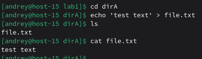
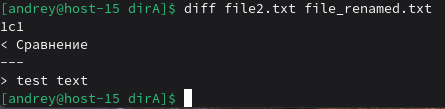
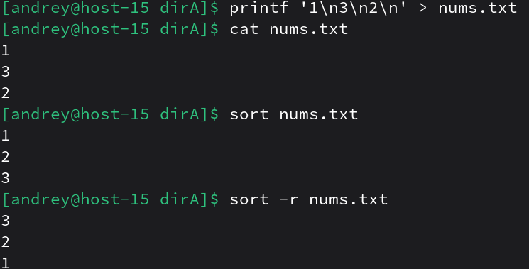
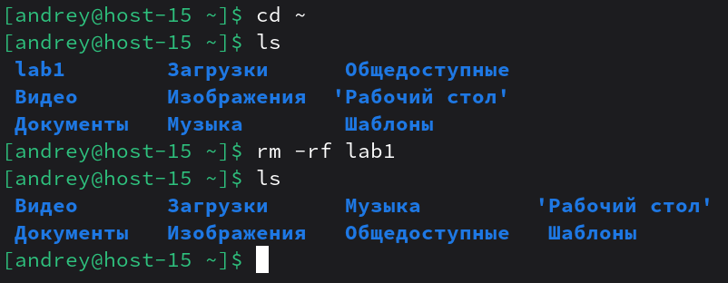

# Работа в консольке

1) Переместиться между директориями<br>
```cd <путь>```
2) Вывести список файлов в директории<br>
    ```ls```
3) Вывести список Всех файлов в директории<br>
    ```ls -a```
4) Создать папку с подпапками<br>
   ```mkdir folder```<br>
    ```cd folder```<br>
    ```mkdir dirA```<br>
    ```mkdir dirB```
5) Внутри папки создать файлик и записать в него что-нибудь<br>

6) Переместить файл из одной директории в другую<br>
    ```mv file.txt ../dirB/```
7) скопировать файл из одной директории в другую<br>
    ```cp file.txt ../dirA```
8) переименовать файл<br>
    ```mv file.txt file_renamed.txt```
9) сравнить содержимое файла<br>
    ```echo 'Сравнение' > file2.txt```<br>
    ```diff file2.txt file_renamed.txt```<br>

10) отсортировать содержимое файла по возрастанию и убыванию<br>

11) удалить все папки и файлы<br>

