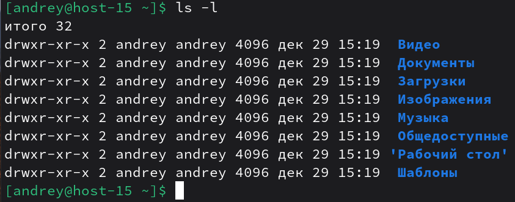

# Управление пользователями

1) Добавьте пользователей user1 и user2:
```
# 1.1 user1 с оболочкой bash
sudo useradd -m -s /bin/bash user1

# 1.2 user2 с оболочкой sh
sudo useradd -m -s /bin/sh user2

# 1.3 задать пароли
sudo passwd user1
sudo passwd user2
```
useradd -m создаёт домашний каталог, -s задаёт оболочку, passwd устанавливает пароль.
2) Назначьте пользователю 1 группу администраторов, польователя 2 добавте в группу пользователя 1
```
# добавить user1 в группу администраторов
sudo usermod -aG wheel user1

# добавить user2 в группу user1
sudo usermod -aG user1 user2
```
usermod -aG добавляет пользователя в дополнительные группы, не убирая старые.
3) Что такое права доступа? Выведите права доступа на файлы в директории пользователя<br>
Права доступа определяют, что владелец, группа и остальные пользователи могут делать с файлом: читать (r), писать (w), выполнять (x).<br>
`ls -l`

4) Как изменить права на файлы? Создайте файл который будет на который у всез пользователей будут все возможные права<br>
Создадим файл и дадим всем пользователям все права (rwx):<br>
```
touch ~/public_all.txt
chmod 777 ~/public_all.txt
ls -l ~/public_all.txt
```
chmod 777 даёт чтение, запись и выполнение всем (владелец/группа/остальные).

5) Как называется учётная запись встренного администратора в linux?<br>
Учётная запись встроенного администратора называется `root`.
6) Как выполнить команду от имени администратора?<br>
`sudo команда`<br>
Работает, если настроен sudo и пользователь в нужной группе.
7) Есть ли ограничения у суперпользователя?<br>
У суперпользователя root почти нет ограничений на уровне прав доступа файловой системы: он может читать, изменять и удалять любые файлы, создавать/удалять пользователей, менять права и т.д.<br>
Ограничения могут быть только на уровне безопасности ядра/SELinux/AppArmor/контейнеров и т.п., но не стандартных Unix‑прав.

8) Удалите пользователя 2 с помощью пользователя 1.<br>
`sudo userdel -r user2`<br>
userdel -r удаляет пользователя и его домашний каталог.
9) Как можно изменить владельца папки? измените владельца папки из пункта 4<br>
Команда для смены владельца - `chown`<br>
Сделаем владельцем `user1`:

```
sudo chown user1:user1 ~/public_all.txt
ls -l ~/public_all.txt
```
Если бы это была папка с содержимым, то нужно было бы применить рекурсию.