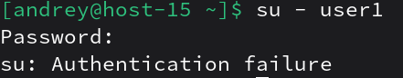

# Запрещаем

1. Запретите пользователю user1 из предыдщуего задания выполнять вход в систему<br>
```
su -
usermod -L user1
```

2. Как вы это сделали?<br>
usermod -L блокирует учётную запись, добавляя символ ! в поле пароля в /etc/shadow, из‑за чего пароль считается недействительным<br>
При вводе правильного пароля:<br>

3. Какие ещё способы это сделать вы знаете?
- Поставить оболочку nologin:
```
su -
usermod -s /sbin/nologin user1
```
/sbin/nologin специально предназначен для запрета интерактивного входа.

- Поставить оболочку /bin/false (сразу завершается):
```
su -
usermod -s /bin/false user1
```
Это тоже эффективно “ломает” интерактивный логин.

- Через passwd -l (лок пароля) — по сути тот же эффект, что и lock через shadow-инструменты:
```
su -
passwd -l user1
```
Это блокирует парольную аутентификацию для пользователя.
4. Можно ли создать пользователей с одинаковыми username?<br>
Обычными утилитами (useradd) — нельзя, они не дадут создать дубликат имени пользователя.<br>
Теоретически администратор может вручную “испортить” /etc/passwd и сделать дубликаты, но это считается ошибкой/уязвимостью: при одинаковом имени вход может “привязаться” к первой записи и привести к проблемам с доступом.