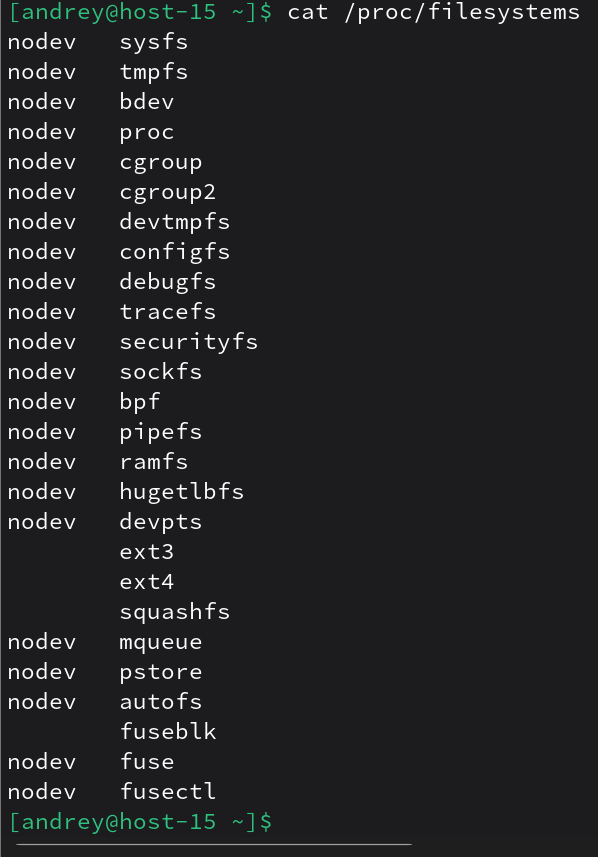

# ФС

1) Какие файловые системы вы знаете?<br>
- Примеры “обычных” (дисковых) ФС: ext2/ext3/ext4, XFS, Btrfs, F2FS, VFAT, NTFS, ISO9660, UDF.<br>
- Примеры сетевых/удалённых: NFS, CIFS/SMB.<br>
- Примеры специальных (псевдо-ФС): procfs (proc), sysfs (sysfs), tmpfs.<br>
2) Как можно классифиировать файловые системы? в чём отличия?
- Дисковые (блочные) — хранят данные на постоянном носителе (HDD/SSD), например ext4, xfs, btrfs.
- Сетевые — дают доступ к файлам по сети (NFS, CIFS), зависят от сети и сервера.
- Псевдо-файловые — не хранят файлы на диске, а показывают данные ядра/системы как “файлы” (procfs, sysfs).
- В памяти — tmpfs хранит данные в RAM (обычно временно, до перезагрузки/размонтирования).

Отличия обычно по: где хранятся данные (диск/память/сеть/ядро), производительность, надёжность (журналирование), поддержка снапшотов/CoW и т.д.
3) Какие файловые системы используются в linux?<br>
В Linux часто используют ext4, XFS, Btrfs; также встречаются F2FS (для флеша), VFAT (флешки/EFI), NTFS (разделы Windows).<br>
Посмотреть, какие типы ФС поддерживает текущее ядро, можно в /proc/filesystems.<br>

4) Как можно создать файловую систему на диске?<br>
Выбрать раздел (например /dev/sdb1) и выполнить mkfs нужного типа.<br>
`sudo mkfs.ext4 /dev/sdb1`<br>
mkfs создаёт структуру файловой системы на устройстве/разделе.
5) Как можно подключить диск в систему, что такое монтирование?<br>
*Монтирование* — это “подключение” файловой системы к определённому каталогу (mount point), чтобы она стала доступна по пути в дереве каталогов.
```
sudo mkdir -p /mnt/disk
sudo mount /dev/sdb1 /mnt/disk
```
mount подключает ФС к каталогу, а список примонтированных ФС можно посмотреть той же командой mount или через таблицу монтирования.
6) файловая система procfs, cifs, tpmfs,sysfs. В чём особенности каждой из них?
Вывести каталоги к которым примонтированы эти файловые системы
- procfs (proc) — псевдо-ФС с информацией о процессах и состоянии системы; обычно смонтирована в /proc.

- sysfs (sysfs) — псевдо-ФС для представления устройств и параметров ядра; обычно смонтирована в /sys.

- tmpfs (tmpfs) — ФС в оперативной памяти (RAM), используется для временных данных; часто встречается в /run, /dev/shm и т.п.

- cifs (cifs) — сетевая ФС для доступа к Windows/Samba-шарам по SMB/CIFS.

Вывести каталоги, куда они примонтированы, через таблицу монтирования:
`cat /proc/mounts | egrep ' (proc|sysfs|tmpfs|cifs) '` 
/proc/mounts содержит список текущих монтирований.
7) Как можно получить информацию о системе используя лишь команду cat?
вывести ифонмацию о процессоре и состоянии памяти системы<br>
Информацию о процессоре и памяти можно прочитать из псевдофайлов в /proc:<br>
```
cat /proc/cpuinfo
cat /proc/meminfo
```

