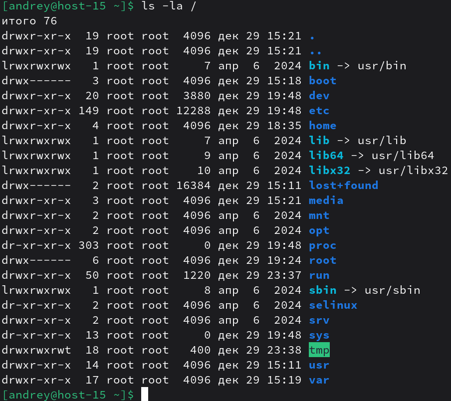

# Струтура каталогов

1) Какая структура каталогов в linux? выведите список файлов в корне системы 
В Linux используется иерархия каталогов, описанная стандартом FHS (Filesystem Hierarchy Standard): всё “вешается” на корень /. 
`ls -la /` 
 
/ - корневой каталог, от которого начинаются все пути.
2) Где хранятся папки пользователей в системе? 
Обычно домашние каталоги обычных пользователей находятся в /home/имя_пользователя 
Проверить для конкретного пользователя можно так: 
`getent passwd andrey` 
В выводе будет поле home directory. 

3) Где домашняя папка суперпользователя? 
Домашний каталог суперпользователя root обычно находится в /root.

4) Где хранятся основые конфигурационные файлы в системе? 
Основные системные конфигурационные файлы традиционно лежат в /etc (настройки системы и сервисов).
5) ЧТо за папки /bin,/sbin,usr/sbin,/usr/sbin
- /bin — важные исполняемые файлы (утилиты), нужные для базовой работы системы и пользователя.

- /sbin — системные утилиты (administration/system binaries), обычно рассчитаны на администратора и нужны для загрузки/восстановления/администрирования.

- /usr/bin — большинство “обычных” программ пользователей (не обязательно критичных для ранней загрузки).

- /usr/sbin — программы для администрирования, которые обычно нужны уже после того, как /usr смонтирован (часто сервисные утилиты)