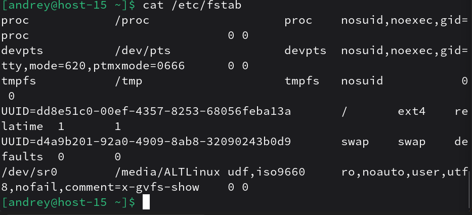
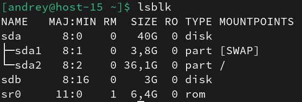
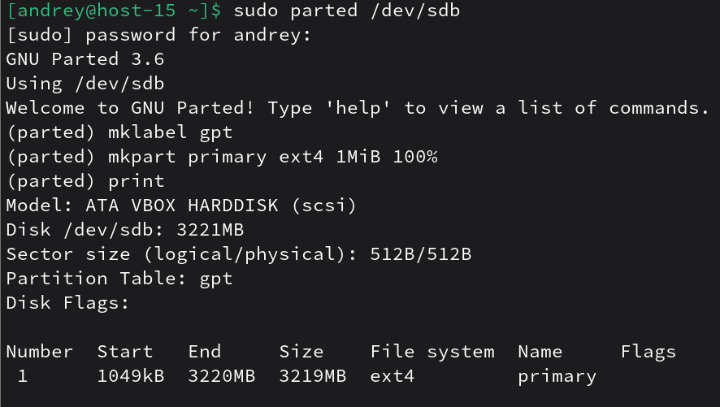
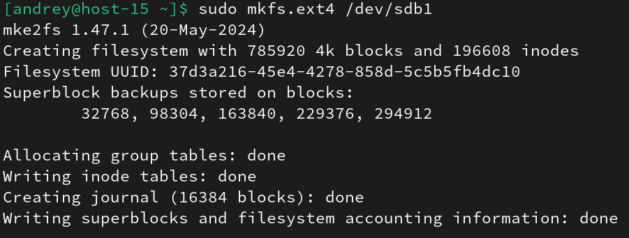
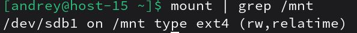
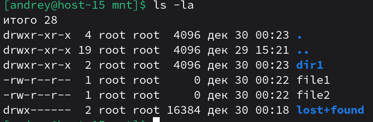
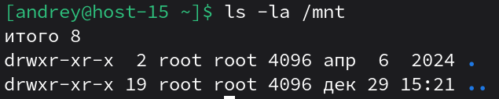
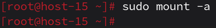
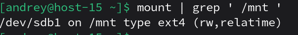

# Продолжаем

1. Выведите содержимое fstab. Что хранится в fstab?<br>
`cat /etc/fstab`<br>
`/etc/fstab` — это файл со статической конфигурацией файловых систем: что и куда монтировать при загрузке (устройство/UUID, точка монтирования, тип ФС, опции, поля dump/fsck).

2. Добавьте в виртуальную машину ещё один диск<br>
Новый диск называется `sdb`<br>

3. Узнайте как ситема видит ваш диск - выведите информацию о блочных устройствах<br>
`lsblk`

4. С помощью полученной информации создайте на диске таблицу разделов и фаловую систему ext4<br>
```
sudo parted /dev/sdb
mklabel gpt
mkpart primary ext4 1MiB 100%
print
```
mklabel создаёт таблицу разделов (GPT), mkpart создаёт раздел, print показывает результат.<br>
<br>
Создаём файловую систему ext4 на разделе<br>
`sudo mkfs.ext4 /dev/sdb1`<br>
`mkfs.ext4` форматирует раздел в ext4.

5. Примонитруте диск в каталог /mnt<br>
```
sudo mkdir -p mnt
sudo mount /dev/sdb1 /mnt
```
`mount` подключает файловую систему к каталогу(точке монтирования)<br>

6. Зайдите в каталог и создайте там файлы
```
cd /mnt
sudo touch file1 file2
sudo mkdir dir1
ls -la
```

7. Отмонтируйте диск и проверье остались ли файлы<br>
`sudo umount /mnt` <br>
`umount` отключает файловую систему от точки монтирования.<br>
<br>
Файлы не исчезли с диска, но без монтирования этот диск “не виден” по /mnt; после повторного mount они появятся снова.

8. Сделайте так чтобы диск автоматически подключался при загрузке систем ( добавьте информацию о нём с fstab)
Узнаем UUID:<br>
`sudo blkid /dev/sdb1`<br>
`blkid` показывает UUID и тип ФС.<br>
```
su -
nano /etc/fstab
```
Добавил в файл строку с UUID.
9. Проверьте корретность записанных в fstab данных перед перезагрузкой
`sudo mount -a`<br>
Попробуем смонтировать всё из fstab. Если в fstab ошибка (UUID не тот, опечатка в точке монтирования, неверный тип), mount -a обычно покажет сообщение об ошибке.<br>

10. Перезагрущите систему и убедитесь что диск был подключён к системе<br>
<br>
Раздел смонтирован в /mnt
