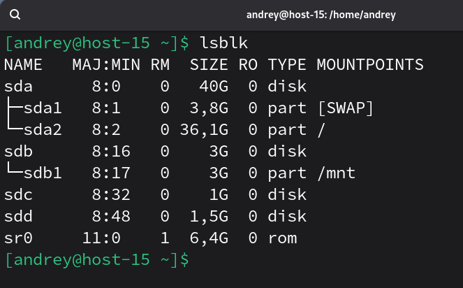
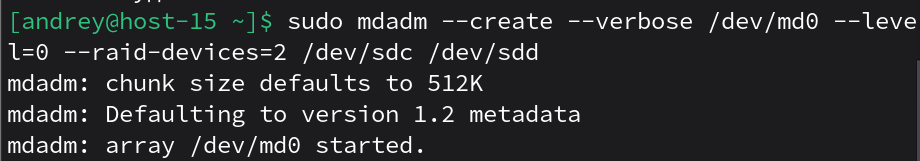
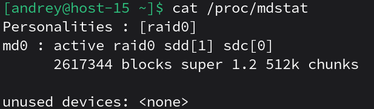
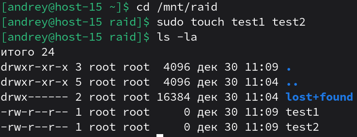
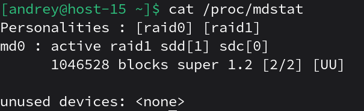

# Продолжаем

1. Raid массивы, что такое икакие бывают<br>
RAID (Redundant Array of Independent Disks) — объединение нескольких физических дисков в один логический массив для повышения производительности и/или отказоустойчивости.<br>
Бывают уровни RAID 0, RAID 1, RAID 5, RAID 6, RAID 10 и другие.
2. Добавьте в виртуальную машину 2 диска отформатируйте их в ext4<br>
Добавил ещё 2 диска(sdc, sdd)

3. Создайте из них raid 0 массив<br>
`sudo mdadm --create --verbose /dev/md0 --level=0 --raid-devices=2 /dev/sdc /dev/sdd`<br>
<br>
Создадим ext4 и смонтируем:<br>
```
sudo mkfs.ext4 /dev/md0
sudo mkdir -p /mnt/raid
sudo mount /dev/md0 /mnt/raid
```
4. Проверье всё ли работает<br>
Статус md:<br>
<br>
Проверка записи:<br>

5. Удалите raid0 и создайте raid1
Удалим raid0:<br>
```
sudo umount /mnt/raid
sudo mdadm --stop /dev/md0
sudo mdadm --zero-superblock /dev/sdb /dev/sdc
```
Создадим raid1:<br>
```
sudo mdadm --create --verbose /dev/md0 --level=1 --raid-devices=2 /dev/sdc /dev/sdd
sudo mkfs.ext4 /dev/md0
sudo mount /dev/md0 /mnt/raid
```

6. В чём между ними разница?
- RAID 0: данные распределяются по дискам (striping) → быстрее и объём суммируется, но отказ одного диска = потеря данных массива.

- RAID 1: данные зеркалируются (mirroring) → выдерживает отказ одного диска, но полезный объём примерно как у одного диска.
7. Есть ли файловые системы которые поддерживают raid массивы без стороненго ПО<br>
Да, есть решения со “встроенным RAID” без mdadm, например Btrfs и ZFS (управляют несколькими дисками на уровне файловой системы/пула).
8. Можно ли создать raid массив во время установки системы?<br>
Да, многие установщики Linux умеют на этапе разметки настроить программный RAID (mdadm), чтобы система установилась сразу на RAID.


