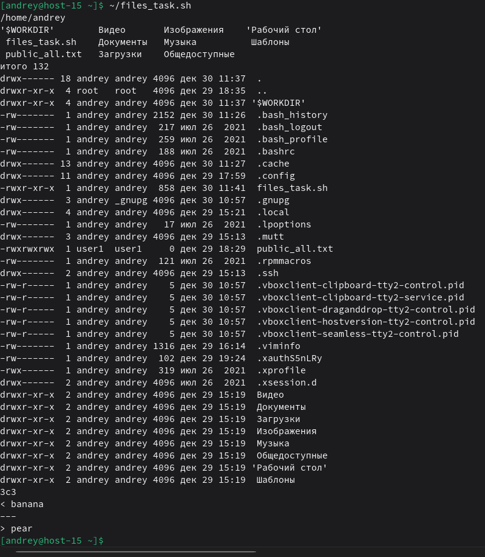

# Скриптуем по полной

1. Что такое шебанг?<br>
Шебанг (shebang) — это первая строка скрипта, начинающаяся с #!, которая указывает ОС, каким интерпретатором выполнять файл (например, bash).<br>
`#!/bin/bash`<br>
`#!/usr/bin/env bash`<br>
Оба варианта задают интерпретатор для выполнения скрипта.
2. Обязательно ли исполняемый файл дожен иметь соотвествующее расширение?<br>
Нет, расширение (например `.sh`) не обязательно и не влияет на возможность запуска.<br>
Обычно достаточно: (1) правильного шебанга, (2) права на выполнение `chmod +x`, либо запускать через интерпретатор `bash scriptfile`.
3. Напишите скрипт который выполнит автоматически действия из блока работы с файлами. ( не забудьте включить set -euo pipefail для того что бы ваш скрипт было удобнее отлаживать. Опишите что включают эти флаги)
```
#!/usr/bin/env bash
set -euo pipefail

# 1) Переместиться между директориями
cd ~
pwd

# 2) Вывести список файлов в директории
ls

# 3) Вывести список всех файлов в директории
ls -la

# 4) Создать папку с подпапками
WORKDIR="$HOME/lab_files"
mkdir -p "$WORKDIR/dir1/subdir"
mkdir -p "$WORKDIR/dir2"

# 5) Внутри папки создать файлик и записать в него что-нибудь
echo "orange" >  "$WORKDIR/dir1/subdir/file1.txt"
echo "apple"  >> "$WORKDIR/dir1/subdir/file1.txt"
echo "banana" >> "$WORKDIR/dir1/subdir/file1.txt"

# 6) Переместить файл из одной директории в другую
mv "$WORKDIR/dir1/subdir/file1.txt" "$WORKDIR/dir2/"

# 7) Скопировать файл из одной директории в другую
cp "$WORKDIR/dir2/file1.txt" "$WORKDIR/dir1/subdir/file1_copy.txt"

# 8) Переименовать файл
mv "$WORKDIR/dir2/file1.txt" "$WORKDIR/dir2/file_renamed.txt"

# 9) Сравнить содержимое файла (diff)
echo "orange" >  "$WORKDIR/dir2/file_other.txt"
echo "apple"  >> "$WORKDIR/dir2/file_other.txt"
echo "pear"   >> "$WORKDIR/dir2/file_other.txt"
diff "$WORKDIR/dir2/file_renamed.txt" "$WORKDIR/dir2/file_other.txt" || true

# 10) Отсортировать содержимое файла по возрастанию и убыванию
sort "$WORKDIR/dir2/file_renamed.txt" >  "$WORKDIR/dir2/sorted_asc.txt"
sort -r "$WORKDIR/dir2/file_renamed.txt" > "$WORKDIR/dir2/sorted_desc.txt"

# 11) Удалить все папки и файлы
rm -rf "$WORKDIR"
```
- `set -e` - завершить скрипт, если команда вернула ненулевой код(ошибка).
- `set -u` - считать ошибкой использование неинициализированных переменных.
- `set -o pipefail` - в конвейере `cmd1 | cmd2` ошибкой считать сбой любой команды, а не только последней.<br>
Запускаем:<br>
```
chmod +x files_task.sh
~/files_task.sh
```

