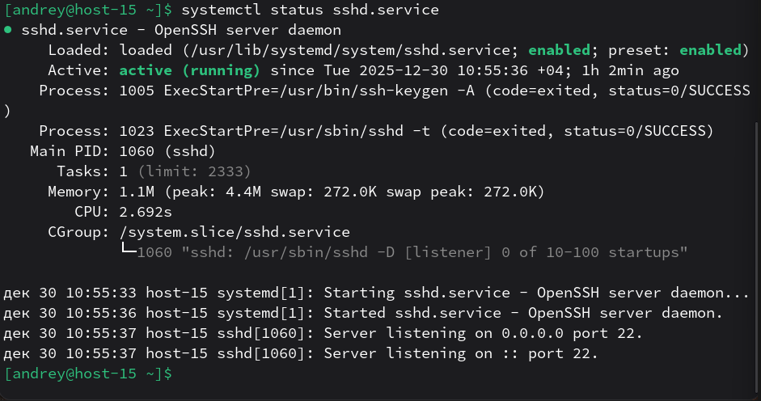
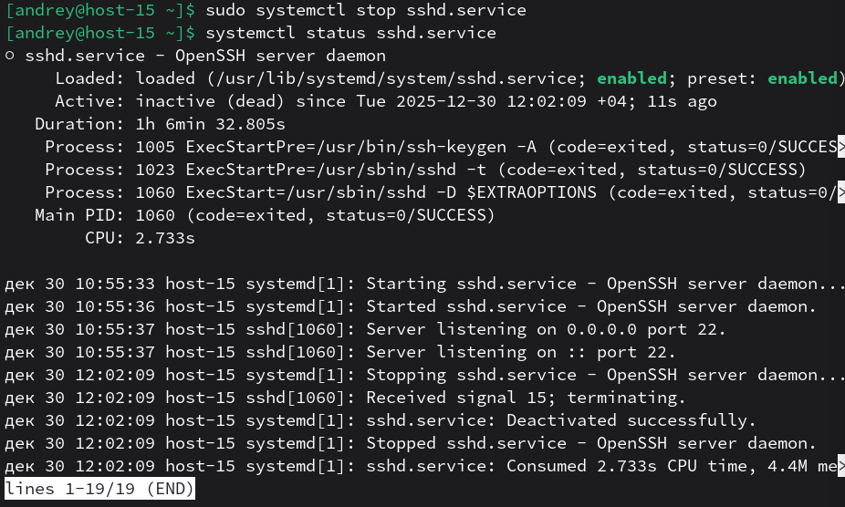
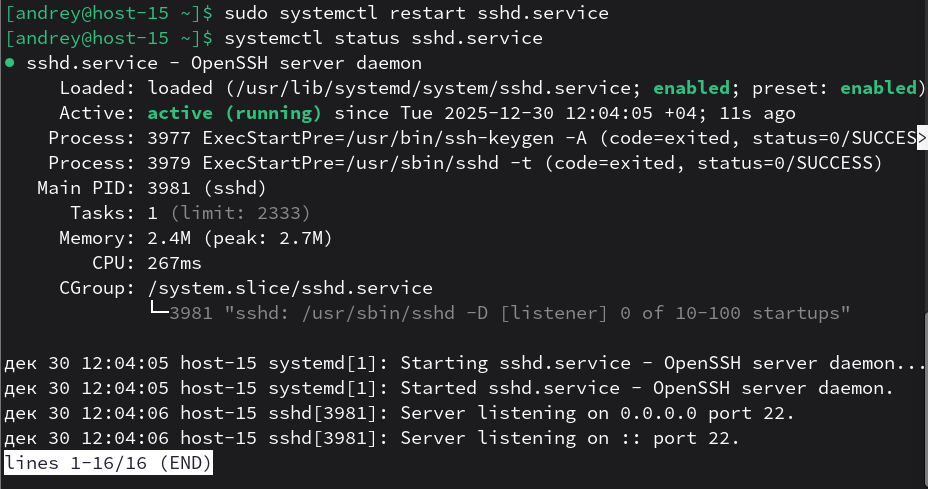
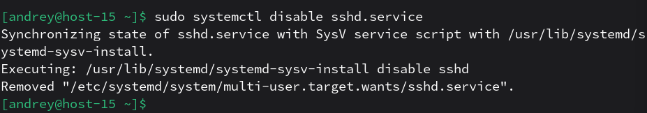
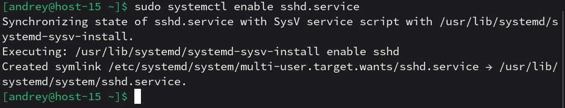

# Юниты

1. Что такое systemd юнит? 
Systemd-юнит (unit) — это объект конфигурации systemd, описывающий ресурс/задачу, которой systemd управляет (например, service, mount, socket, target, timer и т.д.). 
Юниты обычно задаются файлами с расширениями вроде .service, .mount, .socket, .target, .timer.
2. Проверье статус любого systemd юнита, какую информацию выводит эта кманда? 
Проверим sshd: 
`systemctl status sshd.service` 
 
Команда `systemctl status` выводит состояние юнита(loaded/active/sub), информацию о процессе(PID), а также последние строки журнала, связанные с этим юнитом.
3. ПОпробуйте оставновить сервис. 
`sudo systemctl stop sshd.service` 

4. Перезапустите его. 
`sudo systemctl restart sshd.service` 

5. УДалите из автозагрузки 
`sudo systemctl disable sshd.service` 

6. Верните обратно 
`sudo systemctl enable sshd.service` 

7. Что такое таймеры? 
Systemd timers — это юниты с расширением .timer, которые позволяют планировать запуск других юнитов (обычно .service) по времени/событиям, как замена cron-подобному расписанию. 
Таймер-юнит управляется systemd и при срабатывании активирует связанный service-юнит.
