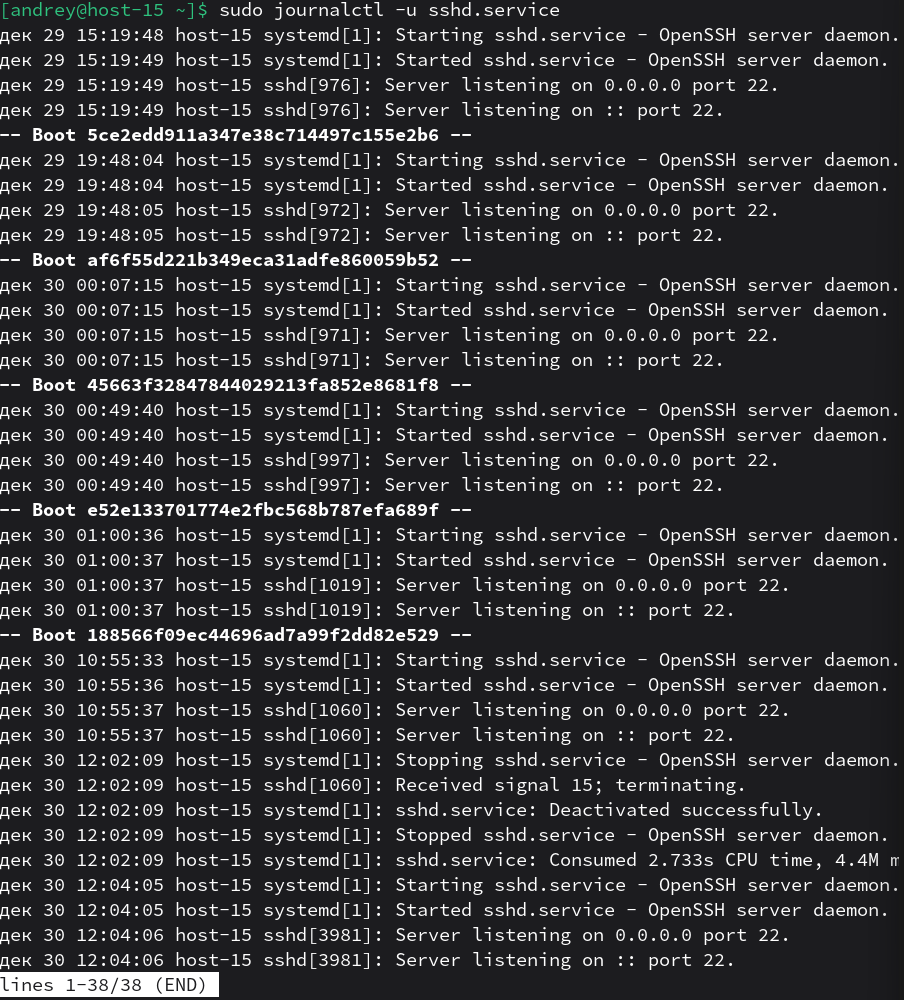
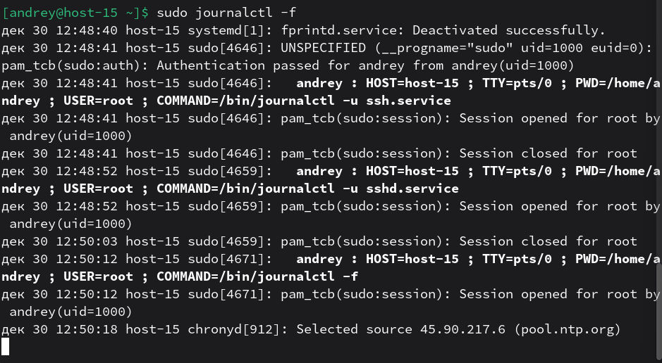
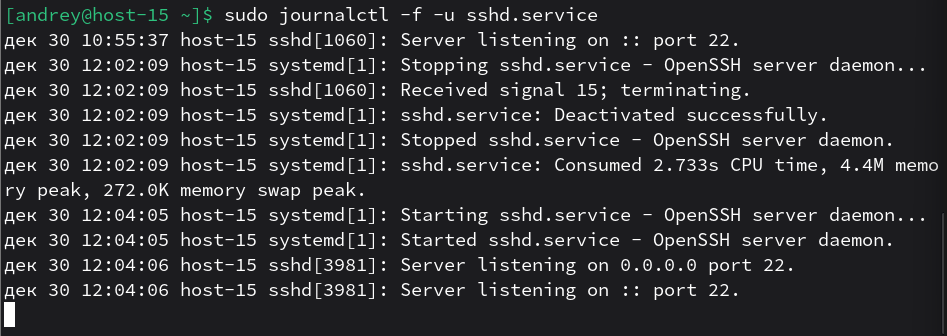

# Журнальчики

1. Посмотретите журналы ssh 
`sudo journalctl -u sshd.service` 
Фильтр `-u` выводит журналы конкретного systemd-юнита. 

2. Выведите журналы в реальном времени 
`sudo journalctl -f` 
Ключ `-f`(follow) показывает новые записи по мере появления. 
 
3. Выведите лог в реальном времени для службы sshd 
`sudo journalctl -f -u sshd.service` 

4. Можно ли без комады journalctl прочитать логи systemd? 
Да, журнал systemd хранится в файлах (обычно в /var/log/journal/ при постоянном хранении или в /run/log/journal/ при непостоянном), но формат бинарный, поэтому без journalctl читать неудобно — обычно нужен journalctl или специализированные средства.
5. Сколько будет 2-2? 
2−2 = (2−2)·1 = (2−2)·(10/10) = ((2·10)/10) − ((2·10)/10) = (20/10) − (20/10) = (20−20)/10 = (2^2 − 2^2)/(2+2) = (4−4)/4 = ln(e^2/e^2) + log10(10^2/10^2) + log2(2^2/2^2) = ln(1)+log10(1)+log2(1) = ln(5!/5!) + ln(((3!)^2)^4/((3!)^2)^4) + ln((7!·8!)/(7!·8!)) = ln(1)+ln(1)+ln(1) = sin(2π) + (cos(0)−1) + (tan(π/4)−1) = sin(2π) + 0 + 0 = ((1000−1)/999) − ((1000−1)/999) = ( (2+3+5) − (3+4+3) ) = (10−10) = √16 − √16 = 4−4 = |−2|−|−2| = ((1+1+1+1)/2) − ((6−2)/2) = 2−2 = 0