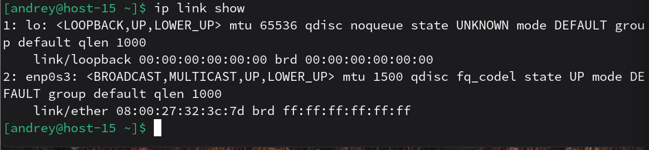
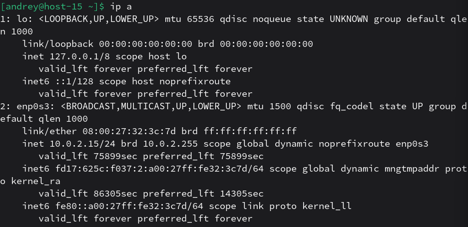
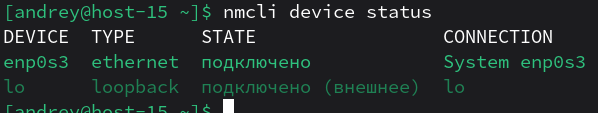
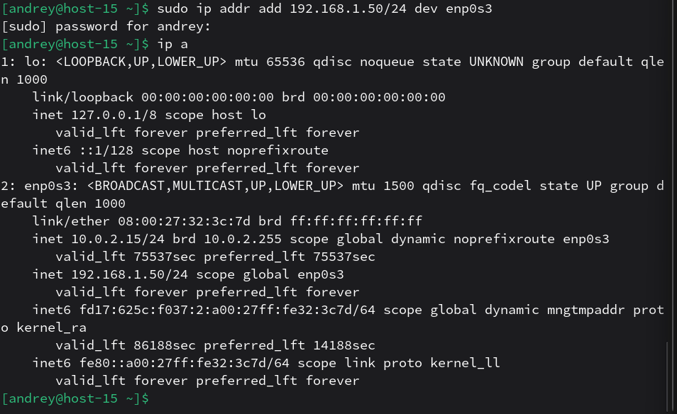
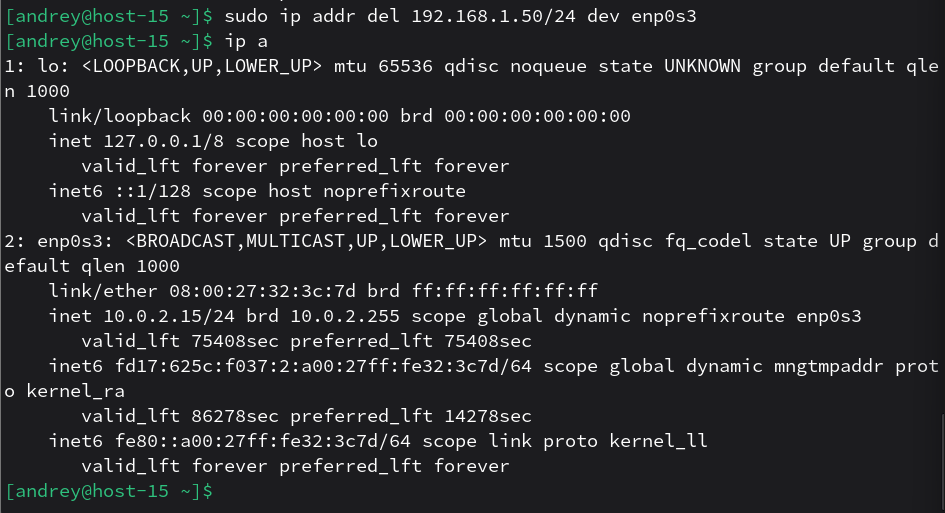
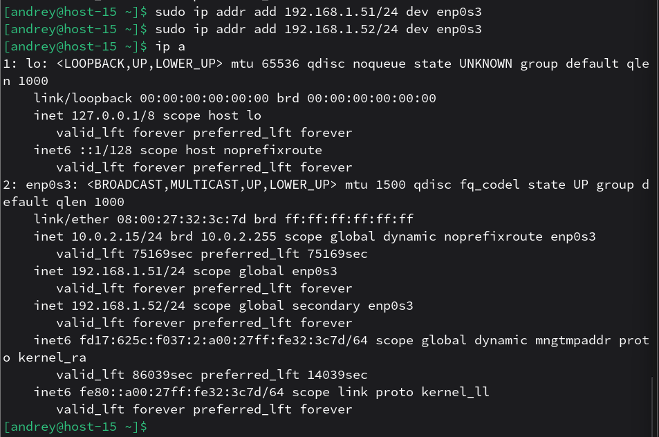
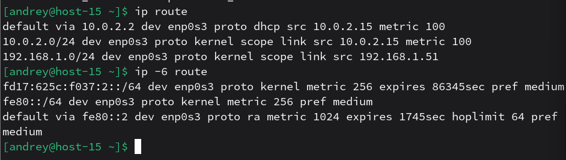
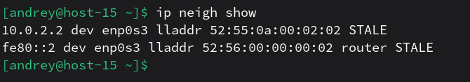

# сети

1. Выведите список интерфейсов, какими способами можно это сделать? 
- `ip link show` - интерфейсы и состояние 
 
- `ip addr show` - интерфейсы + IP 
 
- `nmcli device status` - устройства, если используется NetworkManager 

2. Попробуйте изменить ip адрес 
- `sudo ip addr add 192.168.1.50/24 dev enp0s3` - добавить/поставить адрес 
 
- `sudo ip addr del 192.168.1.50/24 dev enp0s3` - удалить адрес 

3. Попробуте добавить несколько ip адресов на сетевую карту 

4. Выведите список маршрутов 
- `ip route` - IPv4 маршруты 
- `ip -6 route` - IPv6 маршруты 

5. Выведите arp таблицу 
`ip neigh show` - ARP table для IPv4 

6. Что такое ip адрес? 
IP-адрес — это адрес узла в IP-сети, используемый для доставки пакетов до получателя.
7. Для чего нужны маршруты? 
Маршруты нужны, чтобы система понимала, куда отправлять пакеты для разных сетей/назначений (через какой интерфейс/шлюз).
8. Что за протокол arp? 
ARP — протокол, который сопоставляет IPv4-адрес с MAC-адресом в локальном сегменте сети (чтобы можно было отправить кадр на нужное устройство).
9. Что такое dhcp? 
DHCP — протокол клиент‑сервер, который выдаёт хостам параметры сетевой настройки (в т.ч. IP-адрес) автоматически.
10. Что такое dns? 
DNS — система (и протокол), которая преобразует доменные имена в IP-адреса и обратно. (Если нужно, дам 2–3 предложения “как работает” на примере A/AAAA-записей.)
11. Как называется один из протоколов синхронизации времени? 
Один из протоколов синхронизации времени: NTP.
12. Что такое широковещательный запрос, зачем он нужен? 
Широковещательный запрос — это пакет “всем в локальной сети”, который применяют, когда получатель неизвестен на канальном уровне или нужно найти сервис в локальном сегменте (пример: DHCPDISCOVER часто отправляется широковещательно).
13. Какой адресс является широковещательным? 
Широковещательный IPv4-адрес: ограниченный broadcast — 255.255.255.255, а также directed broadcast для конкретной подсети (обычно “последний адрес подсети”).
14. Какие ещё параметры можно задать сетевой карте? 
Кроме IP можно задать/изменять: MTU, MAC (иногда), состояние up/down, скорость/дуплекс (через драйвер/ethtool), VLAN/туннели, а также маршруты и записи соседей (ARP/neighbor).
15. Что такое маска подсети? зачем она нужна? 
Маска подсети (или префикс /24 и т.п.) показывает, какая часть IP-адреса — “сеть”, а какая — “хост”, и нужна, чтобы понять, локальный ли адрес назначения или нужен шлюз/маршрут.