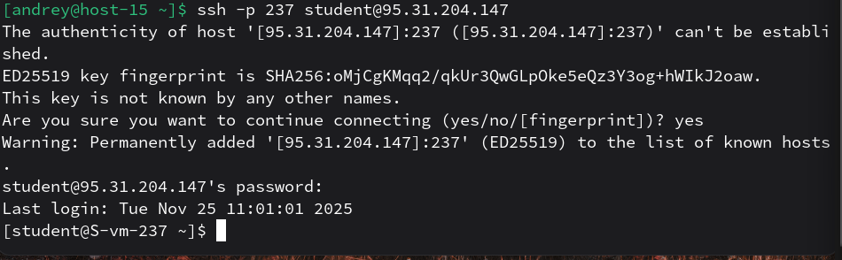
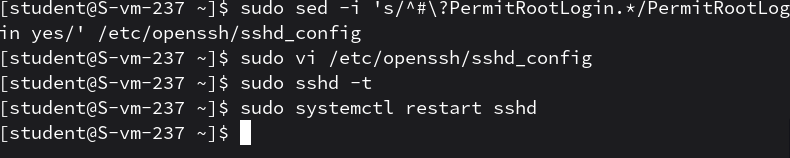
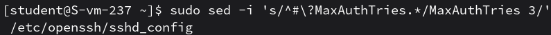
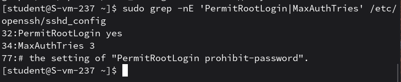
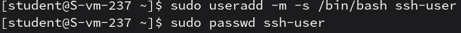
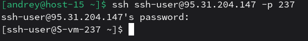
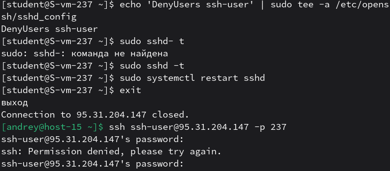

# Настриваем

1. Какой по умолчанию используется порт для поключения? 
Порт по умолчанию: 22/TCP.
2. Можно ли его изменить? если да то как? 
Да, порт можно изменить: в `/etc/ssh/sshd_config` меняют директиву Port (например Port 2222), потом перезапускают sshd
3. Какая служба отвечает за обработку запросов на подключения по ssh? 
За обработку SSH‑подключений отвечает служба sshd (OpenSSH server).
4. Какой файл конфигурации отвечает за его настройку? 
Основной файл конфигурации — `/etc/ssh/sshd_config`
5. Попробуйте подключиться по ssh к предоставленному вам серверу 

6. Отредактируйте файл настроек на сервере так, чтобы была возможность подключиться к серверу используя пользователя root 
`PermitRootLogin` управляет возможностью прямого входа под root по SSH. 

7. Измените колличество ошибок ввода пароля перед сборосом соединения, покажите эти измененения 
 
 
8. Создайте пользователя ssh-user и попробуйте им подключиться к серверу 
 

9. Ограничте ему возможность подключения к серверу 

10. Как вы это сделали? 
Ограничение сделано через добавление директивы DenyUsers ssh-user в конфигурацию sshd, после чего служба sshd была перезапущена для применения настроек.
11. Что хранится в файле known_hosts? 
known_hosts хранит известные ключи хостов (public host keys/их отпечатки) для серверов, чтобы при следующих подключениях клиент мог проверить, что это тот же сервер и ключ не подменили (защита от MITM).