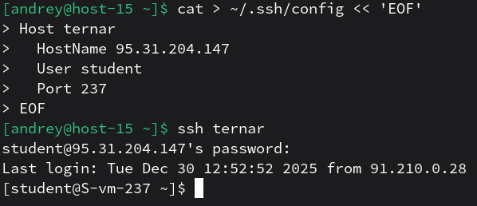

# Конфижим для удобства

1. Где хранятся пользвательские и системные настройки подключения? 
Настройки SSH‑подключений для клиента OpenSSH хранятся в `~/.ssh/config` (пользовательские) и `/etc/ssh/ssh_config` (системные). 
2. Что за файл options?
В OpenSSH “настоящий” файл называется config (внутри `~/.ssh/`) и в нём задаются опции клиента по хостам через блоки `Host ...` и параметры HostName, User, Port и т.д.
3. Отредактируйте файл options так, чтобы можно было подключаться не вводя имя пользвателя и порт 

4. Назовите подключение удобным для вас спсобом 
Подключение называется в строке `Host ...`. Я выбрал название ternar
5. Проверьте работоспособность 
На последнем скриншоте видно, что всё работает.
