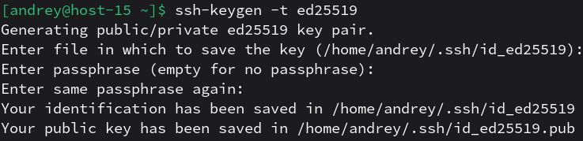
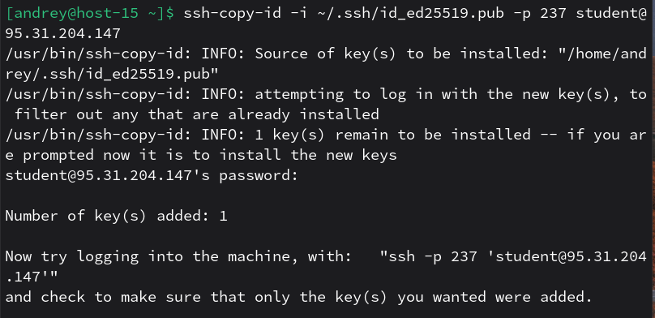
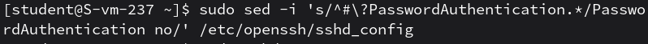

# Ключики

1. Что такое ssh ключи и зачем они нужны? 
SSH‑ключи — это пара криптографических ключей (приватный + публичный) для аутентификации в SSH без передачи пароля по сети и для удобного “passwordless” входа.
2. Как их создать? 
Используется ssh-keygen (на клиентской машине).
3. Создайт пару публичный/приватный ключ ed_25519, где они хранятся? 
 
- Приватный: ~/.ssh/id_ed25519
- Публичный: ~/.ssh/id_ed25519.pub
4. Скопируйте публичный ключ на ваш сервер, в каком файле он будет храниться? 
 
На сервере ключ добавится в файл: `~/.ssh/authorized_keys`
5. Попробуйте подключиться к серверу, у вас запросили пароль? 
Нет, пароль не запросили. 

6. Запретите подключение с паролем для всех пользователей, оставьте только с помощью ключа. 
 
`PasswordAuthentication no` отключает вход по паролю.