# Шарим

1. Установите пакет samba 
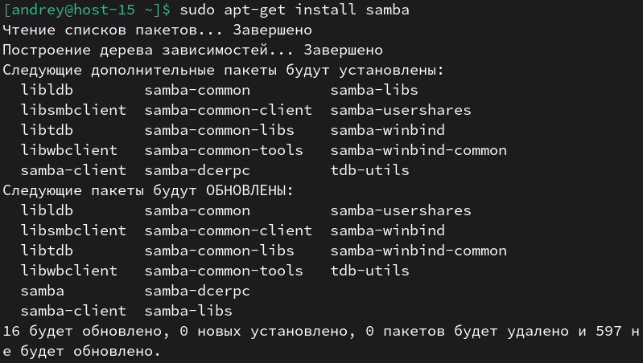
2. ЧТо такое побщая папка, зачем оно может быть нужно? 
Общая папка (Samba share) — это каталог на Linux, который публикуется по SMB/CIFS, чтобы к нему могли подключаться клиенты (обычно Windows/другие Linux) и читать/писать файлы по сети.
3. Создайте общую папку без пароля с правами только на чтение файлов 
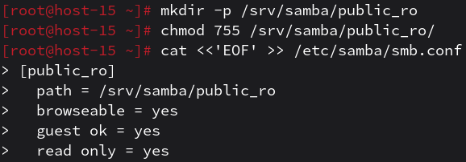 
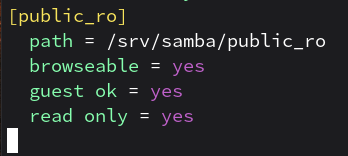 
4. Создайте общую папку с паролем с правами на чтение и запись 
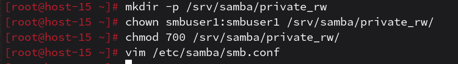 
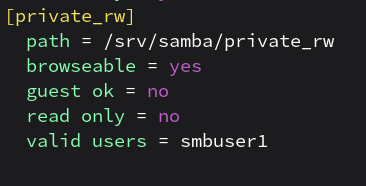 
5. Создайте общую папку с доступом для какой-то группы с полными правами 
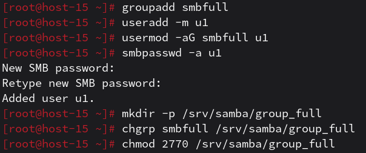 
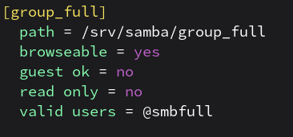 
6. Создайте общую папку в которой у одной группы будет полный доступ, а у другой только доступ на чтение.
Третья группа не должна иметь к ней доступа 
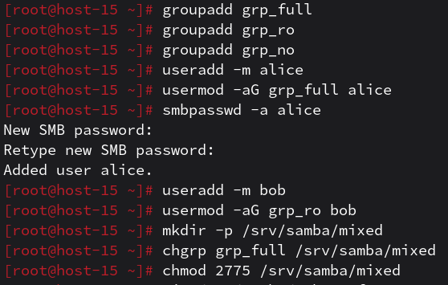 
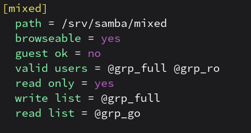 
# Проверка работоспособности

1. Проверим папку без пароля с правами только на чтение файлов: 
- `smbclient //10.0.2.15/public_ro -N` - подключаемся с флагом `-N`(без пароля)
- Проверяем чтение с помощью `ls`
- С помощью `put` пытаемся скопировать локальный файл на Samba-сервер в текущую папку.
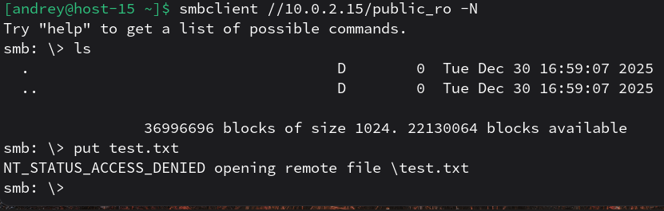 
Как видно из скриншота, чтение файлов работает, а при попытке скопировать файл выдаёт ошибку. 

2. Проверим папку с паролем и правами на чтение и запись: 
`smbclient //10.0.2.15/private_rw -U smbuser1` - подключаемся 
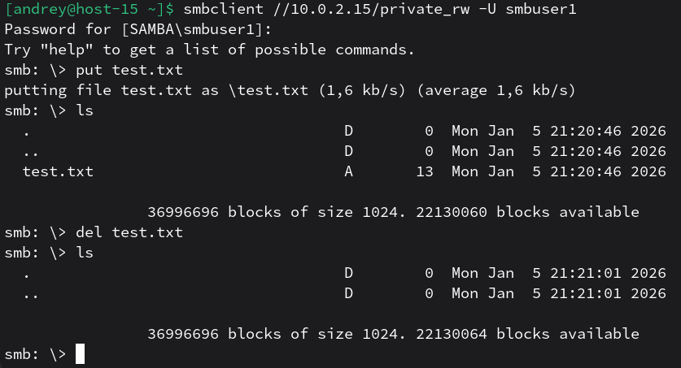 
При попытке подключения запрашивает пароль. Чтение (`ls`) и запись, удаление (`put`, `del`) файлов работают. 
Если попробовать подключиться без пароля, выдаёт ошибку: 

3. Проверим папку с доступом для какой-то группы с полными правами: 
`smbclient //10.0.2.15/group_full -U u1` 
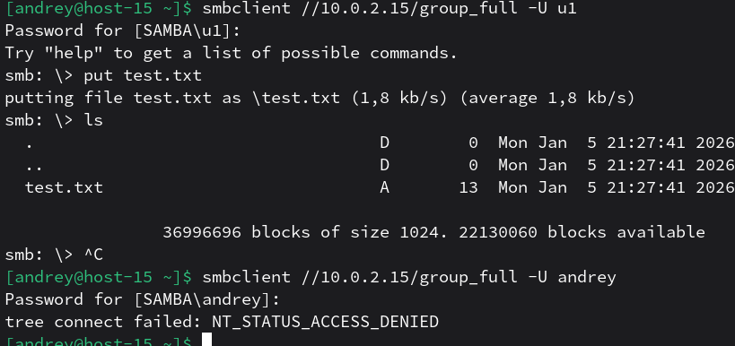 
В пункте 5 я создал группу `smbfull` и добавил в неё пользователя `u1`. Подключение возможно только с этого пользователя, при попытке подключения пользователя, не входящего в эту группу, выдаст ошибку. 

4. Проверим папку с разным доступом для трёх групп: 
В пункте 6 я создал пользователя `alice` и добавил его в группу `grp_full`(группа с полным доступом), а пользователя `bob` добавил в группу `grp_ro`(группа с доступом только на чтение). 
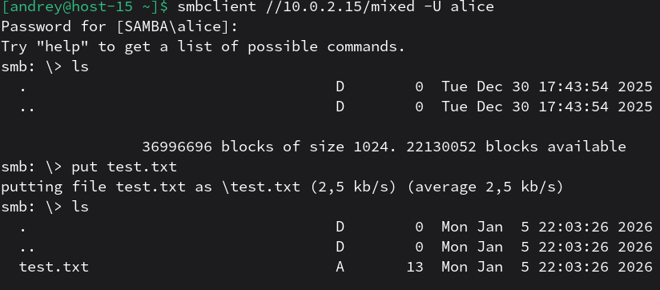 
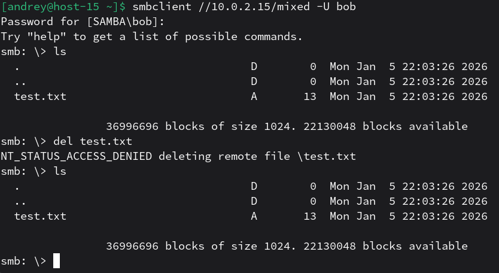 
Как видно из скриншотов, пользователь `alice` может читать и записывать файлы, в то время как `bob` может лишь только читать файлы.