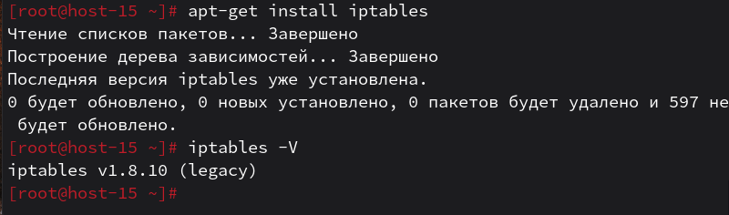

# Открываем iptables

1. Установите iptables<br>

2. Проверьте осталась ли возможность подключения по ssh к вашему серверу<br>
Осталась
3. Почему может пропасть такая возможность?<br>
SSH может пропасть, когда сетевой трафик до sshd перестаёт проходить — чаще всего из‑за firewall/iptables или из‑за того, что sshd больше не слушает нужный порт.
4. Откройте нужный порт на сервере чтобы восстановить подключение<br>
`iptables -A INPUT -p tcp --dport 239 -j ACCEPT`<br>
5. Это будет udp или tcp прот?<br>
SSH работает по TCP.
# Сохраняем

6. Сохраняются ли записанные вами правила после перезагрузки?<br>
Нет, правила, добавленные командой iptables, находятся в памяти и без сохранения пропадут после перезагрузки.
7. Как их сохранить?<br>
Сохранить текущие правила в файл через iptables-save, а затем восстановить через iptables-restore.
```
iptables-save > /etc/iptables.rules
iptables-restore < /etc/iptable.rules
```
