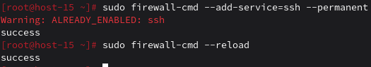
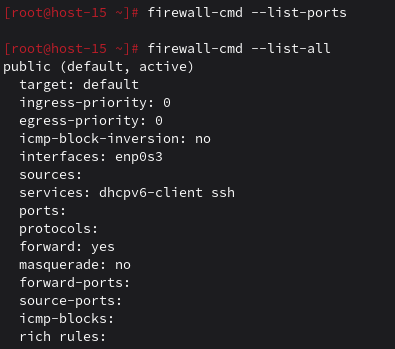
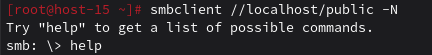
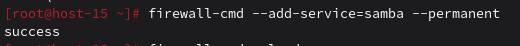

# Открываем firewald

1. Удалите iptables и установите firewalld
```
apt-get remove iptables
apt-get install firewalld
systemctl enable --now firewalld
```
Firewalld управляется через firewall-cmd и работает с зонами (zone) и «сервисами» (service).

2. Попробуйте так-же проверить возможность подключения по ssh<br>
`ssh ternar`

3. Если её нет то откройте порт<br>


4. Выведите список открытых портов с помощью firewall-cmd<br>


5. Можно ли там добавить порты по названию сервиса?<br>
Да, можно добавлять сервисы по названию, например ssh, http, samba.<br>
`firewall-cmd --add-service=ssh`

6. На вашей Локальной виртуальной машине попробуйте подключиться к серверу samba из предыдущих заданий<br>


7. Если не получилось то откройте нужные порты<br>
Получилось

8. Сделайте так чтобы изменения были постоянными<br>



